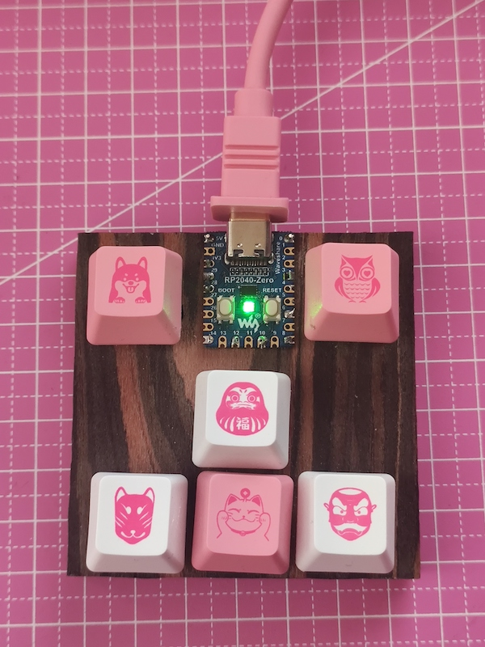

# Raspboard
CircuitPython based HID Keyboard

This project was to quickly add missing keys as separate keyboard. Raspberry Pi Pico chipsed and CircuitPython was chosen for ease to use. RP2040-Zero was picked up from all models for its size and price. 

Files and Folders in project : 

- circuitpython.uf2 - Python for Raspberry Pi PICO. To install , press BOOT button on device, and start it . Once USB drive will show up, put that file there. Device will reset and once it will boot, it will be already installed. You may now proceed with copying code onto it
- usb_package - code to run on Raspberry Pi PICO. Put everything in this folder to USB drive that will show up when you insert device to USB 

{:style="float: left:margin-right: 7px;margin-top: 7px;"}

## Instructions : 
If you want to start from scrach . 
1. Before connecting device to USB , press and keep pressed "Boot" button. It will start device in install mode . USB drive will show up
2. Copy circuitpython.uf2 file onto that drive. After restarting device will enter normal mode. new USB drive will show up
3. Copy content of usb_package folder onto that drive. It contains complete code 

## boot.py 
Contain code that runs only at start. Right now it checks if upper left button is pressed at start. If it is it will enable USB drive. Otherwise that drive will not show up
## code.py
Containst main code. It manage HID keyboard. And is automatically run at start after boot.py file

## Mismatch 
If you mismash code.py and it somehow makes device unoperational you can enter safe mode by pressing reset button and then repeating it 1 second after boot up. boot.py and code.py won't start so you can fix your mistakes

## Documentation
- [Circuit Python essentials](https://learn.adafruit.com/circuitpython-essentials/circuitpython-essentials)
- [NeoPixel library](https://docs.circuitpython.org/projects/neopixel/en/latest/api.html)
- [HID Keyboard](https://docs.circuitpython.org/projects/hid/en/latest/api.html#)
- [Circuit Python release for RP2040-Zero](https://circuitpython.org/board/waveshare_rp2040_zero/)
- [Device RP2040](https://www.waveshare.com/wiki/RP2040-Zero)
- [Mu Editor](https://codewith.mu/)

